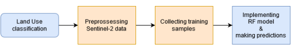
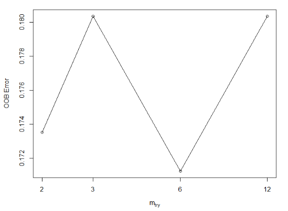
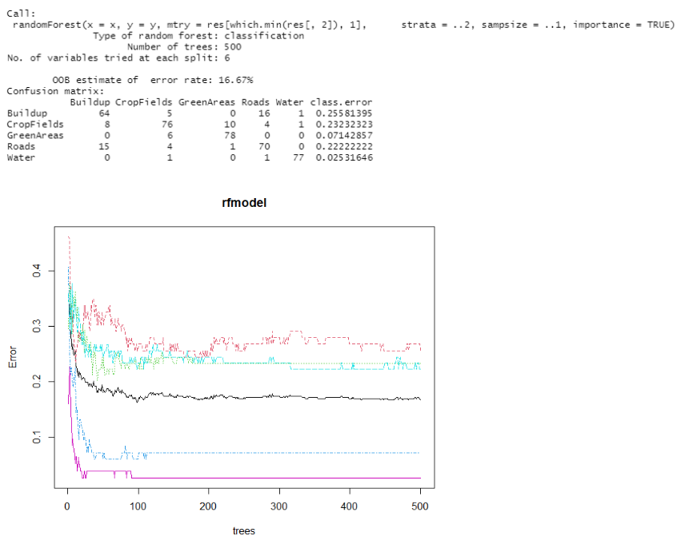
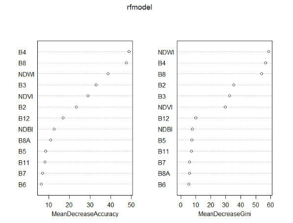

Remote Sensing Image Classification using Random Forest Machine Learning
method
================
Irada Ismayilova

*In this tutorial we will explore Land Use (LU) classification task
using Remote Sensing (RS) data and Random Forest (RF) Machine Learning
(ML) method. LU classification can serve as a basis for many
applications such as change detection.*

## Data

For LU classification you will use freely available Sentinel-2 data. A
single day image from the August of 2021 can be downloaded here:
<https://mediastore.rz.uni-augsburg.de/get/3M8dhzSQLY/>

## Getting started

As with any R project, we will start by importing required libraries.

``` r
library("sp")
library("raster")
library("sf")
library("randomForest")
```

Set the correct working directory.

``` r
setwd("LU_classification")
```

## Analysis

In order to perform land use classification, we will follow the steps
shown in the flowchart below.



## Preprossessing the data

Before we can start with the classification we must prepare the data.
Bands of the Sentinel-2 data come in different spatial resolutions.
Therefore, we must resample them into the same resolution. Further, we
are interested in LU classification in Augsburg. Thus, we must clip the
data to the boundaries of the Augsburg and reproject it.

You are given 10 different bands. We can use file operations and loop in
order to apply any given function to all the bands at once.

``` r
#read in the administrative border (area of interest (AOI)) of Augsburg

AOI <- shapefile()
```

We can define a path variable, which will hold the folder path from/to
which data will be taken/saved.

``` r
path <- "Sentinel_bands"
```

**Clipping bands**

With the help of **list.files** function we can create a list of files
from the given file path with the given pattern (extension/ending).

Using the **gsub** function we can perform pattern matching and
replacement. It is useful when we process a data and want to save it
with a new file name or extension.

``` r
#create a list of all raster files with the .jp2 extension

rasterfiles <- list.files(path = path, pattern = ".jp2")

#create a new pattern extension for the clipped data

patternmatching <- gsub("\\.jp2$", "_clipped.jp2", rasterfiles)

#loop through the list of rasters to clip and save them using the defined extension pattern

for (i in 1:length(rasterfiles)){
  print(i)
  gc()  #since R saves the intermediate data in the memory it is good to clean it to save time 
  r <- raster(rasterfiles[i])
  clip <- raster::crop(r, AOI, filename = patternmatching[i], 
                       overwrite=TRUE)                        
}
```

**Why do we use raster() function within the loop?**

**Reproject and resample the bands**

Using the same approach (creating list, defining pattern and using loop)
reproject and resample the clipped bands.

Note: To avoid additional step for resampling, you can define the
required resolution in the reprojection function.

``` r
#use the CRS of the AOI to reproject the bands


#use the projectRaster() function and pass in the required projection, 'bilinear' projection method as well as 10m output raster resolution
```

Once you successfully reprojected and resampled the bands, you can
change their extents to match each other (bbox).

The workflow is exactly the same as with clipping and reprojecting.
However, first you have to read in one raster band so that you can use
its extent to match others.

``` r
#read in one band 

example <- raster("T32UPU_20210814T102031_B02_10m_reproj.grd")

newextent <- extent(example)

#you can now use the newextent variable to fit the extent of other bands. The function to set the extent to the rasters in the list is setExtent()
```

**Read in all bands**

Now you must have 10 clipped and reprojected Sentinel-2 bands with 10m
resoluion and the same extent. Read them all in R.

``` r
B2 <- raster("T32UPU_20210814T102031_B02_10m_clipped_reprojected_newExtent.grd") 
#B3 
#B4
#B5
#B6
#B7
#B8
#B8a
#B11
#B12
```

## Spectral Indices

Sometimes pure reflectance values could not be very helpful to separate
different objects. Therefore, we can calculate spectral indices to
highlight various characteristics of the studied objects. In this
tutorial we will make use of the Normalized Difference Vegetation Index
(NDVI), The Normalized Difference Built-up Index (NDBI) and The
Normalized Difference Water Index (NDWI) to better differentiate
vegetation, sealed areas and water bodies respectively.

Each vegetation index can be easily calculated using index special
formula and bands.

- NDVI: (B08 - B04) / (B08 + B04)
- NDBI: (B06 - B05) / (B06 + B05)
- NDWI: (B03 - B08) / (B03 + B08)

``` r
# calculate NDVI

NDVI <- (B08 - B04) / (B08 + B04)

# calculate NDBI


#Calculate NDWI
```

Now we can stack all the bands and indices together

``` r
Rasstack <- stack(B2, B3, B4, B5, B6, B7, B8, B8A, B11, B12, NDVI, NDBI, NDWI)

names(Rasstack) <- c("B2", "B3", "B4", "B5", "B6", "B7", "B8", "B8A", "B11", "B12", "NDVI", "NDBI", "NDWI")
```

## Training data

For LU classification we require a training data. This can be collected
using e.g. google earth (GE).

In the GE under “new” project you can create new “KML” data. Using the
location icon create location points for the five different LU: Green
areas (forest, parks, playgrounds), Built-up areas, Roads (railway,
street, path), Water bodies and crop (agricultural) fields.

``` r
#read in the training kml data using sf package

#kml <- read_sf()

#then reproject it

kml_prj <- st_transform(kml, crs = crs(AOI))
```

We can now extract pixel values for each training point location.

``` r
#extract pixel values using extract() function. Use df=True to output a dataframe

training.Data <- extract()
```

Name column in the dataframe contains LU types. We will turn this column
into the factor data type because classifiers can only work with integer
values instead of strings such as “built-up” or “crop”. When converting
to factors, strings are sorted alphabetically and numbered
consecutively. In order to be able to read the classification image at
the end, we should make a note of the classification key.

The **levels()** function combines all occurrences in a factor-formatted
vector e.g. 1 for built-up. 2 for greenery etc.

``` r
#check the order of the LU classes

levels(as.factor(kml_prj$Name))

for (i in 1:length(unique(kml_prj$Name))) {
  cat(paste0(i, " ", levels(as.factor(kml_prj$Name))[i]), sep="\n")
  
}
```

We can use the ID column in the dataframe to establish a relationship
between the ID of each pixel and the LU class using the **match()**
function and add a new column that stores this relationship.

``` r
training.Data$cl <- as.factor(kml_prj$Name[match(training.Data$ID, seq(nrow(kml_prj)))])

#remove the ID column. We do not need it anymore

training.Data <- training.Data[-1]

#replace the NA with 0
```

Check how many training points there are for each LU class.

``` r
str(training.Data)
summary(training.Data$cl)
```

Usually there is an imbalance in the number of training pixels. So,e
classes might be represented with a higher number of pixels than others.
This might result in classifiers favoring higher represented classes in
the classification. We can therefore apply a down-sampling method where
number of randomly drawn cases from each class will be the same as the
size of the smallest class. With the **str()** function you can already
see which LU class has the smallest size which we will use further.

``` r
smp.size <- rep(min(summary(training.Data$cl)), nlevels(training.Data$cl))

smp.size
```

In this tutorial we will use **tuneRF** from the RF package to train the
model. This function automatically searches for the best parameter
setting for mtry. We have to only specify ntree – the number of trees to
grow. Usually the more the better. But higher number of trees in the
forest increases computing time.

In the tuneRF() we have to specify x: all columns of the dataframe
except the last one and y: the last column of the dataframe called “cl”.
You can check other parameters with *?tuneRF()*.

Note this will a be a multiclass classification.

``` r
#train Rf model using tuneRF()

rfmodel <- tuneRF(x = training.Data[-ncol(training.Data)],
                  y = training.Data$cl,
                  sampsize = sample.size,
                  strata = training.Data$cl,
                  ntree = 250,
                  importance = TRUE,
                  doBest = TRUE
)
```



tuneRF directly outputs a plot that shows OOB error depending on the
mtry. We can output more accuracy parameters by calling the rfmodel
variable.

``` r
#output the accuracy parameters fo the trained model

rfmodel

#plot the model to see how error decreases as the number of trees in the forest increase

plot(rfmodel)
```



``` r
#check the importance of each variable

varImpPlot(rfmodel)
```



If you are satisfied with the accuracy of the trained model you can use
it to perform LU classification for the whole of Augsburg.

``` r
result <- predict(Rasstack,
                  rfmodel,
                  filename = "classification.tif",      #you can directly save the results to the working folder
                  overwrite = TRUE
)
```

Check the results by plotting the predicted raster.
